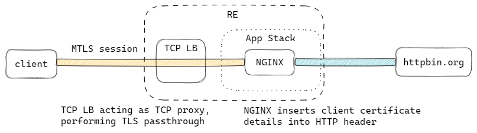

# Client Certificate Extraction

This example showcases NGINX deployed on App Stack to terminate mutual TLS connection from a client, and extracts information from the certificate presented by the client, and inserts them into HTTP headers.



## Demo

```
VESCTL_P12=<path to XC API certificate>

NAMESPACE=$(terraform output --raw namespace)

TCP_LB_FQDN=$(terraform output -raw proxy_fqdn)

TCP_LB_IP=$(vesctl -n $NAMESPACE --p12-bundle $VESCTL_P12 configuration get tcp_loadbalancer $NAMESPACE --outfmt json | jq -r .spec.dns_info[0].ip_address)

curl -k --cert $(terraform output -raw client_cert_file) --key $(terraform output -raw client_key_file) --resolve $TCP_LB_FQDN:8443:$TCP_LB_IP https://$TCP_LB_FQDN:8443/headers
```

You should [httpbin.org](httpbin.org) returning the headers it sees in the request, which include the `Client-Dn` and `Client-Pem` HTTP headers inserted by NGINX:
```
{
  "headers": {
    "Accept": "*/*",
    "Client-Dn": "CN=client-cert-insertion-51233.client.example.com,O=F5",
    "Client-Pem": "-----BEGIN%20CERTIFICATE-----%0AMIID%2BzCCAmOgAwIBAgIQPekVmzSisfZkNiHU2usbADANBgkqhkiG9w0BAQsFADBV%0AMR4wHAYDVQQKExVta2NlcnQgZGV2ZWxvcG1lbnQgQ0ExFTATBgNVBAsMDGxlb25A%0ANU5OUzBGMzEcMBoGA1UEAwwTbWtjZXJ0IGxlb25ANU5OUzBGMzAeFw0yMzA0MDUw%0ANDQxMDBaFw0yNDAxMzAwNDQxMDBaMEYxCzAJBgNVBAoTAkY1MTcwNQYDVQQDEy5j%0AbGllbnQtY2VydC1pbnNlcnRpb24tNTEyMzMuY2xpZW50LmV4YW1wbGUuY29tMIIB%0AIjANBgkqhkiG9w0BAQEFAAOCAQ8AMIIBCgKCAQEAtkQvQKFLMTZXUpNYsFaw5lM4%0AcjTZK8tYJeAXH8ZLwoBfvSUuukTwdmBtOd2XfSlWnpJrA1y0vFVDzfCZj5%2FC4X%2BZ%0AwZLHsGY3i7Hy6Wcqy3k1Kp3aNRBJLB90pfgtELz9qhg62lvOL2r5Uv0sATqEPIgF%0AdlpqaNWy5LfcQNWFZTa5M8yP99Wl4xrScXEmY4LT%2Buuf1b7wlIzNnGTCmV2JVHt5%0AJSsKqmD6Hp11kdkxA8HJnH1vsx%2FayRzyoujsaiT8mhyfDN%2BNbroZYXlx%2FMICP1tV%0A7zBnNBE%2Fr3FmBpMx1Jks4kG3MZUemfLs4HekvzgwWGY3wKp2OUUagpMlpO2F3wID%0AAQABo1YwVDAOBgNVHQ8BAf8EBAMCBaAwEwYDVR0lBAwwCgYIKwYBBQUHAwIwDAYD%0AVR0TAQH%2FBAIwADAfBgNVHSMEGDAWgBTT8JIY%2Bh%2Bxg8x%2BmRmYoJjgYHrPeDANBgkq%0AhkiG9w0BAQsFAAOCAYEAxtxVTWpF0rBwFWNX6GlcINFxbCMs2HM957qkXE24NAYL%0ASYRhJNYhFcpPaRbfrMwYxWIzaXMoRYJ2ICH%2FpHPMT0IsY5fV9IQ%2FGJKyycXdkWEW%0AEZfjYV8GMWpeYf4hE7NyXCNcU5VKGI9x3FEC9%2BBFlmRQqSaBIHkCBvakcB%2FynFfV%0A0dHsSLt93B5RX3n4oORBKSs%2FkmAa2V%2B4HZvLjaB%2FS%2BMMaO9vqLsKNUMpPj5CNtgd%0AsPFwXquxoxT1oUK6g5IId33xrm1pkKETDIP9ci27xBwSHU%2FGOoPL2y7%2B%2F7JpI1LI%0AVVBRYYLPPvce4Z7rvBs3ZMjtYuijq%2Bz7p3ENKhYlyIsBf9Pf5FC%2FQ4DeQ8a4wQi%2F%0ALwr2wS7j76CDyGJrbWJqEZR7Go5wmwcz8o%2BC5jPyfaf1SMd%2BYiacImFXrACwbBD4%0An975YV3M%2BaQsddc9eufnF6tNdKEdwWQR8wD%2BE6qik69JEwPGAH9UQN0fPzJL%2F7EP%0AvfvGtsgB6g9fVwzQh9XS%0A-----END%20CERTIFICATE-----%0A",
    "Host": "client-cert-insertion-51233.example.com",
    "User-Agent": "curl/7.68.0",
    "X-Amzn-Trace-Id": "Root=1-642d0536-408b26e767bac5523656c0e4"
  }
}
```
