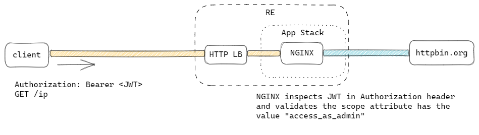

# JSON Web Token Claim Validation

This example showcases NGINX deployed on App Stack to validate a claim in a JSON Web Token (JWT).



## Demo

```
LB_FQDN=$(terraform output -raw proxy_fqdn)
LB_IP=$(terraform output -raw proxy_ip)
```

First, access the proxy without presenting a JWT token. You should receive a `401 Unauthorized` error:
```
$ curl --resolve $LB_FQDN:8080:$LB_IP http://$LB_FQDN:8080/ip
<html>
<head><title>401 Authorization Required</title></head>
<body>
<center><h1>401 Authorization Required</h1></center>
<hr><center>nginx/1.23.2</center>
</body>
</html>
```

Next, creating a JWT token with a claim `scope: access_as_admin` in the payload (see [jwt.io](https://jwt.io/)).
```
JWT=<encoded token>
```

Access the proxy again, this time include the JWT in the `Authorization` header. NGINX will validate the value of the `scope` attribute, and if successful, proxies the connection to [httpbin.org](httpbin.org), returning a successful response.
```
$ curl -H "Authorization: Bearer $JWT" --resolve $LB_FQDN:8080:$LB_IP http://$LB_FQDN:8080/ip
{
  "origin": "202.171.162.98, 103.135.58.105"
}
```
