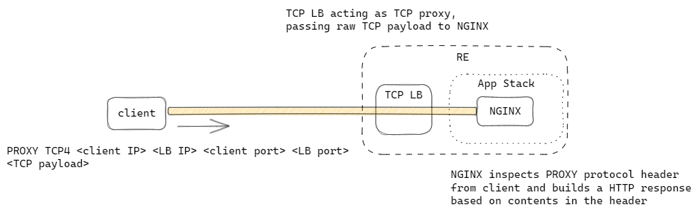

# PROXY protocol parsing

This example showcases NGINX deployed on App Stack to parse PROXY protocol header and returns a HTTP response showing the header contents.



## Demo

```
VESCTL_P12=<path to XC API certificate>

NAMESPACE=$(terraform output --raw namespace)

TCP_LB_FQDN=$(terraform output -raw proxy_fqdn)

TCP_LB_IP=$(vesctl -n $NAMESPACE --p12-bundle $VESCTL_P12 configuration get tcp_loadbalancer $NAMESPACE --outfmt json | jq -r .spec.dns_info[0].ip_address)

$ curl --haproxy-protocol --resolve $TCP_LB_FQDN:8080:$TCP_LB_IP http://$TCP_LB_FQDN:8080
```

You should see the following response from NGINX on App Stack returning the values it sees in the PROXY protocol header provided by `curl` via the `--haproxy-protocol` flag:
```
Received PROXY protocol string: 192.168.233.157:51050 to 111.111.111.111:8080
```
