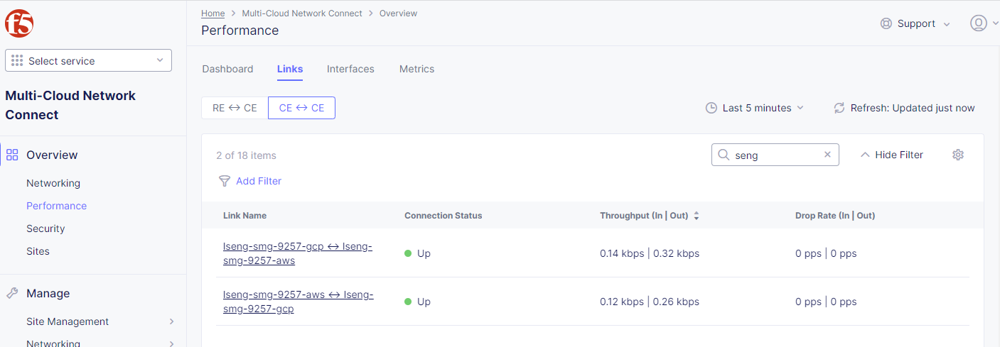
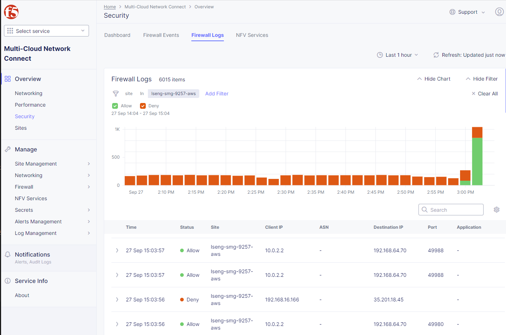

# F5 Distributed Cloud Site Mesh Group (AWS/GCP)

Login
```
aws sso login
gcloud auth application-default login
```

## Capabilities demonstrated

**Site Mesh Group**

Data plane path is formed between AWS CE and GCP CE directly




**L3 network stitching (Global Network)**

Disparate network segments (with non-overlapping IP ranges) can be connected via Global Network. Subnets which are the CEs are not directly connected to can be discovered manually by specifying static routes on each CE site.

SSH to AWS VM and perform a curl test from AWS VM towards httpbin container running on GCP VM
```
$(terraform output -json aws_vms| jq -r .[0].ssh_cmd)
```

Perform a curl test from AWS VM towards httpbin container running on GCP VM by hitting the GCP VM IP address directly.
```
$ while true; do date; curl --max-time 2 10.0.2.2/ip; sleep 1; done
Wed Sep 27 05:05:44 UTC 2023
{
  "origin": "192.168.64.70"
}
Wed Sep 27 05:05:45 UTC 2023
{
  "origin": "192.168.64.70"
}
```

**Enhanced Firewall Policies**

Perform a ping test from AWS VM towards GCP VM. This will fail as the firewall policies only allows HTTP traffic
```
$ ping -w 5 -v 10.0.2.2
PING 10.0.2.2 (10.0.2.2) 56(84) bytes of data.

--- 10.0.2.2 ping statistics ---
5 packets transmitted, 0 received, 100% packet loss, time 4078ms
```


